    光栅显示器：可以看作一个像素矩阵，在光栅显示器上显示的任何一个图形，实际上都是一些具有一种或多种颜色的像素集合。

    光栅图形：对一个具体的光山县十七来说，像素个数是有限的，像素的颜色和灰度等级也是有限的，像素是有大小的，所以光栅图形只是近似的实际图形。
        ——光栅显示器上显示的图形，称为光栅图形
        ——图形光栅化之后，显示在屏幕上的一个窗口里，超出窗口的部分不予显示。确定一个图形的哪些部分在窗口内，必须显式;哪些部分在窗口外不予显示，即为“裁剪”
        ——在光栅图形中，非水平和垂直的直线用像素集合表示时，会呈锯齿状，这种现象称为走样，用于减少或消除走样的技术称为反走样


# 直线段的扫描转换算法
    通过求出直线的斜率，让x保持步进，每次步进一个像素单位，y每次步进一个斜率（并通过强制转换为int保留有效信息）

## 1、DDA画线算法
```cpp
void DDALine(int x0,int x1,int y0,int y1,int color)
{
    int x;
    float dx,dy,y,k;
    dx = x1 - x0;
    dy = y1 - y0;
    k = dy/dx;
    for(x=x0;x<=x1;x++)
    {
        drawPixel(x,(int)(y+0.5),color);
        y += k;
    }
}
```
上述算法仅适用于|k|<=1时的情况，若|k|>1，可以将y与x互换。y与k必须用浮点数表示，而且每一步都需要对y进行取整，这使得它不利于硬件实现。

## 2、中点画线法
    假设直线方程为F(x,y) = ax+by+c = 0;
    则可得出步进的下一个点的位置，若d = F(x1,y1) >= 0，则y++，否则y不变（前提是只考虑k大于0的情况）
    由于只需要知道d的符号就可以判断下一个像素点，为了避免小数，可以采用2*d进行运算。
```cpp
void MidpointLine(int x0,int y0,int x1,int y1,int color)
{
    int a,b,d1,d2,d,x,y;
    a = y0-y1;b = x1-x0;d = 2*a+b;
    d1 = 2*a;d2 = 2*a+b;
    x = x0;y = y0;

    while(x<x1)
    {
        if(d<0>)
        {
            x++;y++;d+=d2;
        }
        else
        {
            x++;d+=d1;
        }
        drawPixel(x,y,color);
    }
}
```
上述算法同样无法计算k>1，甚至无法计算k<0（可以通过优化if else结构支持k<0）

## 3、Bresenham算法
    设直线方程为y=kx+b，则可知下一步的y1=k(x1-x)+b=y+k，即下一个像素的列坐标x++,y=y或y++。y是否自增取决于误差项d的值。d+=k,若d>=0.5，则y++，若d<0.5，则y=y，且需要将d保持在0~1的范围之内，即当d>=1时，d--。

    将d的初始值设置为-0.5，便于通过符号判断

```cpp
void Bresenhamline (int x0,int y0,int x1, int y1,int color)
{ 
    int x, y, dx, dy;
    float k, e;
    dx = x1-x0;dy = y1- y0;k=dy/dx;
    e=-0.5;x=x0;y=y0;
    for (i=0;i<=dx;i++)
    { 
        drawpixel (x, y, color);
        x++;e=e+k;
        if (e>=0)
        {
            y++; 
            e=e-1;
        }  
    }
}
```
此算法依然没有考虑k>1和k<0

由于该算法使用了大量除法和浮点数，故可以将d替换为-dx，省去求k的步骤：
```cpp
void InterBresenhamline (int x0,int y0,int x1, int y1,int color)
{ 
    dx = x1-x0;dy = y1- y0;e=-dx;
    x=x0;y=y0;
    for (i=0; i<=dx; i++)
    {
        drawpixel (x, y, color);
        x++; e=e+2*dy;
        if (e>=0)
        { y++; e=e-2*dx;}
    }
}
```

# 圆、椭圆的扫描转换

## 1、八点画圆法
    圆是一个八对称图形，故将圆心设置为原点时，可以同时构造八段圆弧。
    当x==y时，停止画弧。

中点画圆算法：
```cpp
void MidPointCircle(int r, int color)
{ 
    int x,y;
    float d;
    x=0; y=r; d=1.25-r;
    circlepoints (x,y,color); //显示圆弧上的八个对称点
    while(x<=y)
    { 
        if(d<0) d+=2*x+3;
        else { d+=2*(x-y)+5; y--;}
        x++;
        circlepoints (x,y,color);
    }
}
```

```cpp
void circlepoints(int x,int y,int color)
{
    drawPixel(x,y,color);drawPixel(x,-y,color);
    drawPixel(-x,y,color);drawPixel(-x,-y,color);
    drawPixel(y,x,color);drawPixel(y,-x,color);
    drawPixel(-y,x,color);drawPixel(-y,-x,color);
}
```

## 2、椭圆的扫描转换算法
    椭圆斜率绝对值小于1时，在x方向取单位步长
    椭圆斜率绝对值大于1时，在y方向取单位步长
### 上半部分：
    
下一对候选像素的中点是(x+1,y-0.5)  
判别式 $d1=F(x+1,y-0.5)=b^2(x+1)^2+a2(y-0.5)^2-a^2b^2$
#### 增量:
$$
d1<0时  
d1'=F(x+2,y-0.5)=d_1+b^2(2x+3)  
$$
$$
d1>0时
d1'=F(x+2,y-1.5)=d_1+b^2(2x+3)+a^2(-2y+2)
$$

### 下半部分：

下一对候选像素的中点是(x+0.5,y-1)
判别式 $d_2=F(x+0.5,y-1)= b^2(x+0.5)^2+a^2(y-1)^2-a^2b^2$

增量的xy互换

# 区域填充算法
    – 区域填充即给出一个区域的边界，要求对边界范围内的所有像素单元赋予指定的颜色代码。
    – 区域填充中最常用的是多边形填色。
    – 多边形填色即给出一个多边形的边界，要求对多边形边界范围的所有像素单元赋予指定的颜色代码。
    – 要完成这个任务，一个首要的问题，是判断一个像素是在多边形内还是外。

### 填色算法分为两大类：  
    1.扫描线(Scanline)填色算法。  
    - 这类算法建立在多边形边界的矢量形式数据之上，可用于程序填色，也可用于交互填色。  

    2.种子(Seed)填色算法。  
    - 这类算法建立在多边形边界的图像形式数据之上，并还需提供多边形界内一点的坐标。所以，它一般只能用于人机交互填色，而难以用于程序填色。

## 1、活性边表法
活性边：和当前扫描线有交点的边
活性边表节点的数据结构：  
|x|Δx|$y_{max}$|
|---|---|---|
|当前扫描线与边的交点的x值|从当前扫描线到下一扫描线x的增量|活性边所交的最大值|

该数据结构代表扫描线与y轴平行时，每条扫描线扫描的过程中x遍历到活性边表中的每个x区间，并由Δx推断出下一条扫描线所对应的活性边表

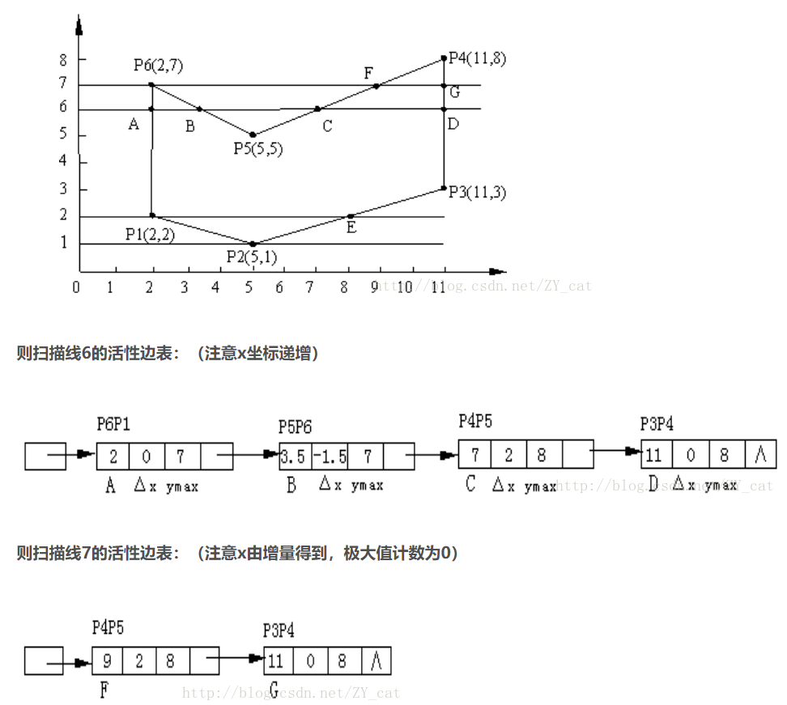

新边表：若不规则图形在一个扫描线上出现了一条新的边，而活性边表中没有对应数据，则无法从上一条活性边中完整推出下一条完整活性边。则需要一个额外的数据结构维护每一个扫描线上出现的新的边，此数据结构即为新边表。新边表中存储的数据结构与活性边表相同。不同的是，这是一个链表集合，为每条扫描线维护了一个链表。

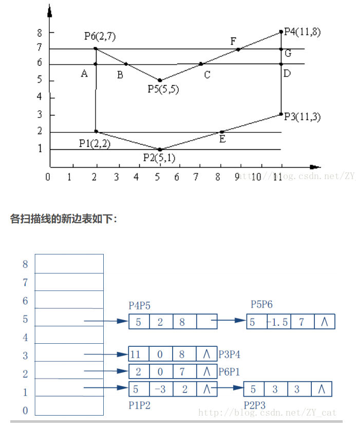

伪代码：
```cpp
int color;多边形 polygon;

void polyfill(polygon,color)
{
    for(扫描线i)
    {
        初始化新边表头指针NET[i];
        将ymin=i的边放入NET[i];//即将边最底下的点放入新边表
    }

    y=最低扫描线号;
    初始化活性边表AET为空;
    for(扫描线i)
    {
        把NET[i]中的边节点用插入排序法插入AET表，使之按x递增的顺序排列;
        若允许多边形的边自相交，则用冒泡排序法对AET进行重新排列;//自相交：即图形内部的边存在相较
        遍历AET，把配对交点区间(左闭右开)上的像素(x,y)用drawPixel(int x,int y,int color)改写像素颜色值;
        遍历AET，把ymax=i的节点删除，并把ymax>i的节点的x值递增Δx;
    }
}
```

## 2、种子填充算法
采用递归实现，需要有一个已知的在填充区域内的点作为“种子”，种子填充算法分为四联通和八联通，分别对应种子的各个方向。

4联通的种子递归填充算法为：
```cpp
void BoundryFill4(int x,int y,int boundary_color,int new_color)
{
    int color = getPixelColor(x,y);
    if(color != new_color&&color != boundary_color)
    {
        drawPixel(x,y,new_color);
        //下面对四个方向做递归扫描
        BoundryFill4(x,y+1,boundary_color,new_color);
        BoundryFill4(x,y-1,boundary_color,new_color);
        BoundryFill4(x+1,y,boundary_color,new_color);
        BoundryFill4(x-1,y,boundary_color,new_color);
    }
}
```

# 裁剪
    裁剪是裁去窗口之外物体的一种操作

## 1、直线段裁剪
    直线段裁剪算法是复杂图元裁剪的基础。
    复杂的曲线可以通过折线段来近似，从而裁剪问题也可以转化为直线段的裁剪问题。

每段直线的端点都被赋予一组四位二进制代码，称为区域编码(region code，RC)，用来标识直线段端点相对于窗口边界及其延长线的位置。  

假设窗口是标准矩形，由上、下、左、右4条边界组成，延长窗口的4条边界形成9个区域。这样根据直线段的任一端点P(x，y)所处的窗口区域位置，可以赋予一组4位二进制编码，称为区域码RC=C3C2C1C0。C0代表左边界， C1代表右边界， C2代表下边界， C3代表上边界。

为了保证窗口内及窗口边界上直线段端点的编码为零，定义规则如下：  
C0：若端点的 x < wxl，则C0=1，否则C0=0。  
C1：若端点的x > wxr，则C1=1，否则C1=0。  
C2：若端点的y < wyb，则C2=1，否则C2=0。  
C3：若端点的y > wyt，则C3=1，否则C3=0。  

1.若直线段的两个端点的区域编码都为0，有RC0|RC1=0（二者按位相或的结果为零，即RC0=0且RC1=0），说明直线段的两个端点都在窗口内，应“简取”之（trivally accepted）。  

2.若直线段的两个端点的区域编码都不为0，且RC0&RC1≠0（二者按位相与的结果不为零，即RC0≠0且RC1≠0），说明直线段位于窗外的同一侧，或左方、或右方、或上方、或下方，应“简弃”之（trivally rejected）。  

3.若直线段既不满足“简取”也不满足“简弃”的条件，则需要与窗口进行“求交”判断。这时，直线段必然与窗口边界或窗口边界的延长线相交，在交点处把线段分为两段，其中一段完全在窗口外，可
弃之，另一段重复上述处理。

求交点代码：
```cpp
#define LEFT 1    //0001
#define RIGHT 2   //0010
#define BOTTOM 4  //0100
#define TOP 8     //1000
……
if(LEFT&code !=0)//判断是否与左侧相交
{x=XL;y=y1+(y2-y1)*(XL-x1)/(x2-x1);}
else if(RIGHT&code !=0)//判断是否与右侧相交
{x=XR;y=y1+(y2-y1)*(XR-x1)/(x2-x1);}
else if(BOTTOM&code !=0)//判断是否与下部相交
{y=YB;x=x1+(x2-x1)*(YB-y1)/(y2-y1);}
else if(TOP & code !=0)//判断是否与上部相交
{y=YT;x=x1+(x2-x1)*(YT-y1)/(y2-y1);}
……
```
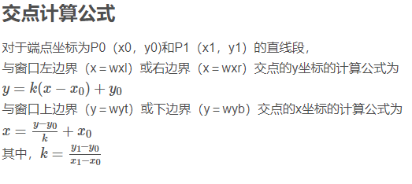

## 2、中点分割法
从P0出发找最近可见点的方法：  

    p0 ——————pm—————— p1
    1. 先求出P0P1的中点Pm  
    2. 若P0Pm不是显然不可见的，并且P0P1在窗口中有可见部分，则距P0最近的可见点一定落在P0Pm上，所以用P0Pm代替P0P1;
    3. 否则取PmP1代替P0P1;
    4. 再对新的P0P1求中点Pm。重复上述过程，直到PmP1长度小于给定的控制常数为止，此时Pm收敛
    于交点。

从P1出发找最近可见点采用上面类似方法。

## 3、Cyrus-Beck算法
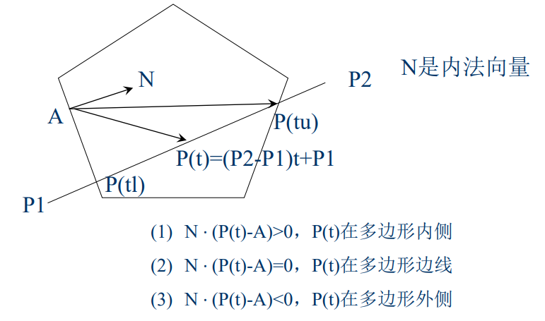

与多边形的每条边均须计算一次
计算量大，只适用凸多边形

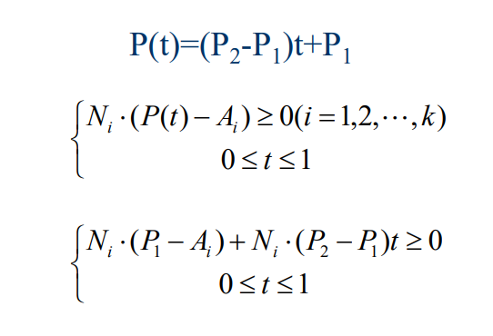

## 4、梁友栋算法 
即简化版Cyrus-Beck算法，裁剪多边形为四边形

实现代码:
```cpp
void LB_LineClip(float x1,float y1,float x2,float y2,float XL,float XR,float YB,float YT)
{
    float dx,dy,u1,u2;
    tl=0;tu=1;dx =x2-x1;dy =y2-y1;
    if(ClipT(-dx,x1-Xl,&u1,&u2)
        if(ClipT(dx,XR-x1, &u1,&u2)
            if(ClipT(-dy,y1-YB, &u1,&u2)
                if(ClipT(dy,YT-y1, &u1,&u2)
                {
                    displayline(x1+u1*dx,y1+u1*dy, x1+u2*dx,y1+u2*dy)
                    return;
                }
}

bool ClipT(float p,float q,float *u1,float *u2)
{
    float r;
    if(p<0)
    {
        r=q/p;
        if(r>*u2)
            return FALSE;
        else if(r>*u1)
        {
            *u1=r;
            return TRUE;
        }   
    }

    else if(p>0)
    {
        r=p/q;
        if(r<*u1)
            return FALSE;
        else if(r<*u2)
        {
            *u2=r;
            return TRUE;
        }
    }
    else if(q<0) 
        return FALSE;
    return TRUE;
}
```

## 5、多边形裁剪
对于多边形的每条边进行边裁剪，输出的点组成一个全新的多边形，这个多边形便是被裁减后的多边形。点的选取方式如下

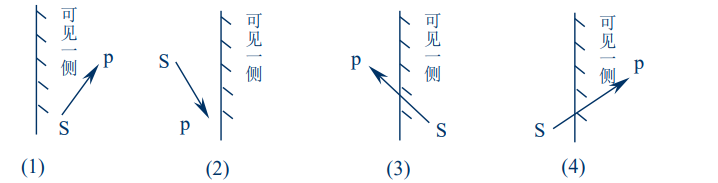

算法步骤如下：
1、已知：多边形顶点数组src，顶点个数n，
　 　　　　　定义新多边形顶点数组dest。

2、赋初值：用变量flag来标识：0表示在内侧，1表示在外侧。

 3、对多边形的n条边进行处理，对当前点号的考虑为：0～n-1。
 ```cpp
for(i=0;i<n;i++)
{
    if(当前第i个顶点是否在边界内侧？)
    {
        if(flag!=0) /*前一个点在外侧吗？*/
        {
            flag=0;/*从外到内的情况，将标志置0,作为下一次循环的前一点标志*/
            (dest + j) =求出交点;　/*将交点dest放入新多边形*/
            j++;
        }
        (dest + j)= (src + i); /*将当前点srci放入新多边形*/
        j++;
    }
    else
    {
        if(flag==0) /*前一个点在内侧吗？*/
        {
            flag=1;/*从内到外的情况，将标志置1,作为下一次循环的前一点标志*/
            (dest + j) =求出交点;　/*将交点dest放入新多边形*/
            j++;
        }
    }
    s= (src + i); /*将当前点作为下次循环的前一点*/
}

```

## 6、字符裁剪
字符裁剪有三种裁剪方式：  
1. 串精度：将包围字符串的外接矩形对窗口作裁剪。
2. 字符进度：将包围字符的外接矩形对窗口作裁剪
3. 像素精度：将笔划分解成直线段对窗口作裁剪

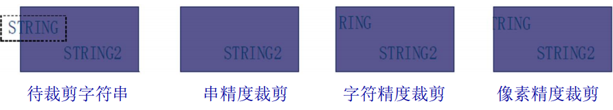
    

# 线宽线型、字符、反走样

## 1、线宽处理

### 1、直线线宽的处理
- 线刷：
    - 算法简单
    - 线的始末端是水平或垂直的
    - 斜率不同，线的宽度不同
    - 对于宽度为偶数个像素的直线会产生偏移

- 方形刷：
    - 方形中心对准单像素宽的线条上各个像素
    - 存在重复写像素的问题
    - 线条末端是水平或垂直的，且线宽与线条方向有关
    - 对于宽度为偶数个像素的直线会产生偏移

区域填充法：······

### 2、圆弧线宽的处理
- 线刷：
   - 在小于45°时使用水平刷子，在大于45°时用垂直刷子，即在经过曲线斜率为±1的点时刷子的方向要改变
- 方形刷：
   - 不需要改变刷子的方向，只需要沿着单像素宽的轨迹，把正方形中心对准轨迹上的像素，把方形内的像素全部置成线条颜色
- 区域填充法：······

## 2、线型处理
- 实线、虚线、点划线
- 线形的表示：布尔值序列

## 3、字符处理
计算机中字符由一个数字编码唯一标识。

表示方法：
1. 点阵字符
> 每个字符由一个位图表示
- 每一个字符有一个位图表示
- 存储空间大，但易于显示
- 显示时，先将位图从字库中读取出来，然后将位图写入帧缓冲器中

2. 矢量字符
> 由直线段和曲线段组成，记录字符的笔画信息
- 记录的是字符的笔画信息
- 存储量小，美观，变换方便，但需要光栅化之后才能显示

字符属性：
1. 字体
2. 字高
3. 字倾斜角
4. 字色

## 4、走样与反走样
走样：
> 用离散量表示连续量引起的失真现象称之为走样

反走样：
> 用于消除走样的技术便是反走样

反走样方法：
1. 提高分辨率

   - 将显示器的分辨率提高，显示出的直线段看起来就平直光滑了
   - 同时阶梯的宽度减小了
   - 同样会导致存储器和扫描转换时间的消耗增加
   - 每增加一倍的分辨率，将会减小一倍的阶梯宽度，以及花费4倍的存储器空间和2倍的扫描转换时间
   - 并且不能完全消除锯齿

2. 区域采样

   - 将直线段看作具有一定宽度的狭长矩形
   - 当直线段与像素相交时，求出两者相交区域的面积，然后根据相交区域面积的大小确定该位置像素的亮度
   - 区域采样的离散方法：
      - 首先将屏幕像素均分为n个子像素
      - 然后季孙中心点落在直线段内的子像素个数
      - 将该像素的屏幕亮度置为最大灰度值x相交区域面积的近似值
   - 简单区域采样的缺点：
      - 像素的亮度与相交区域的面积成正比，而与相交区域落在像素内的位置无关，这仍然会导致锯齿效应
      - 直线条上沿理想直线方向的相邻两个像素有时会有较大的灰度差

3. 加权区域采样

   - 使相交区域对像素亮度的贡献依赖于该区域与像素中心的距离
   - 当直线经过该像素时，像素的亮度时在两者相交区域上对滤波器进行积分的结果
   - 加权区域采样的离散方法：
      - 将屏幕像素划分为n个子像素
      - 求出所有中心位于直线段内的子像素
      - 计算这些子像素对原像素亮度贡献之和乘以像素的最大灰度值（与卷积运算类似），即通过加权表得出子像素的权重和，通过总权重求出亮度。
      - 加权表可取 $\frac{1}{16} \left[\begin{matrix} 1 & 2 & 3 \\4 & 5 & 6 \\7 & 8 & 9\end{matrix}\right]$

# 图形变换
## 1、二维图形变换
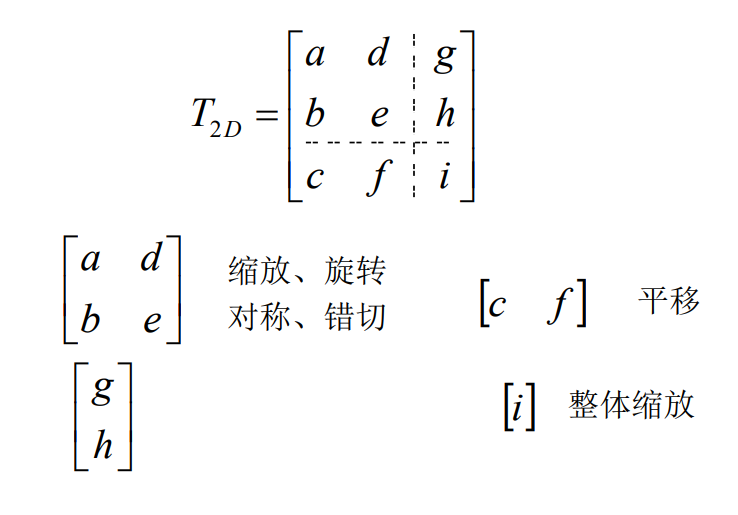
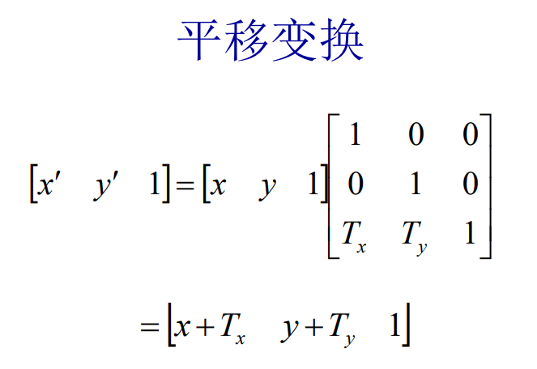
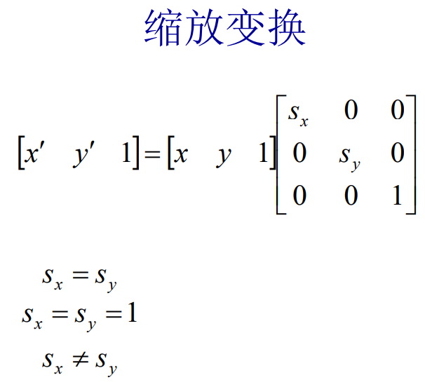
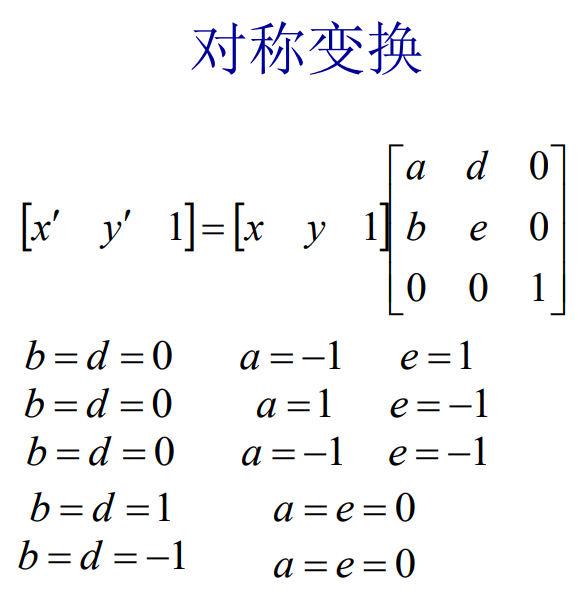
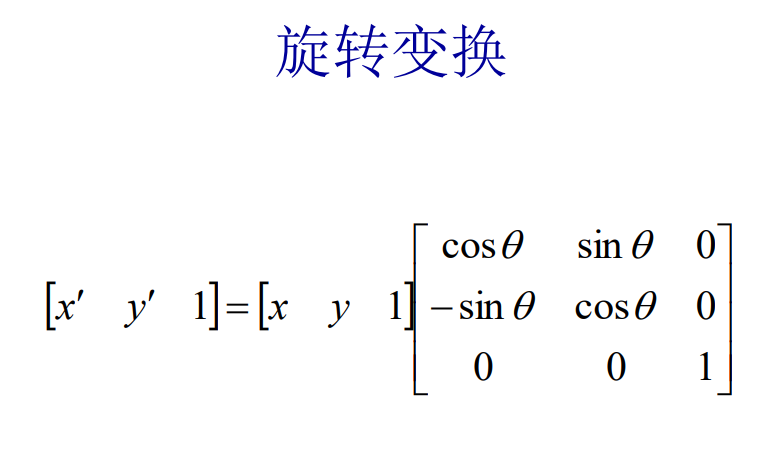
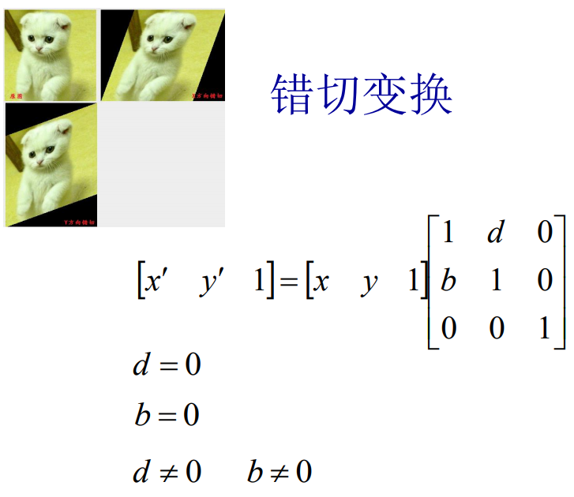

### 复合变换
$$
T_t = T_{t1}T_{t2}
$$
即多个变换矩阵的乘积

## 2、三维图形变换
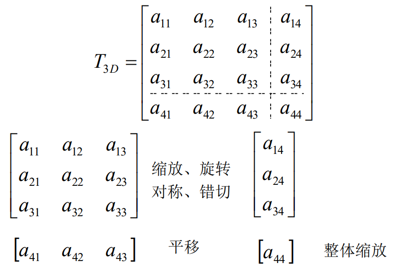
平移变换：
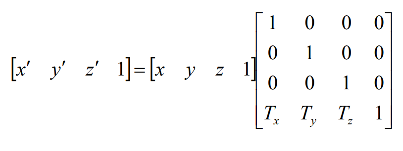
缩放变换：
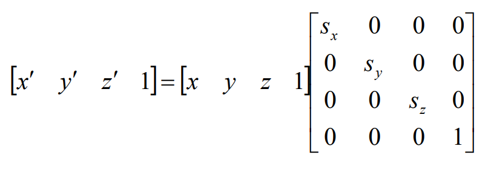
绕轴坐标旋转变换:
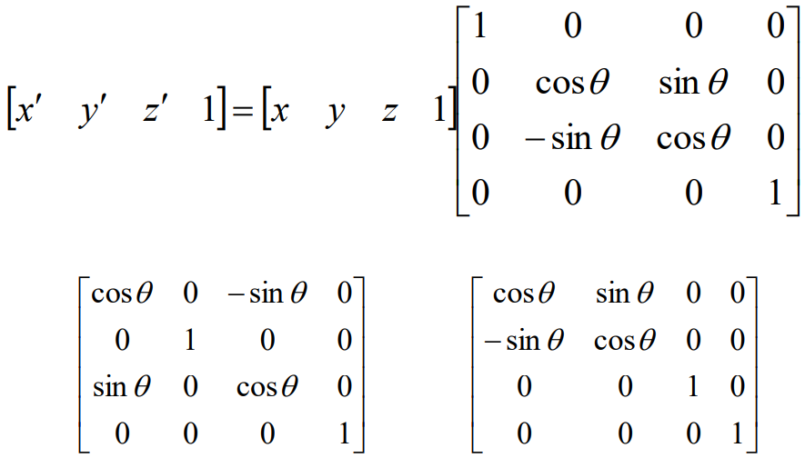
绕任意轴旋转变换：
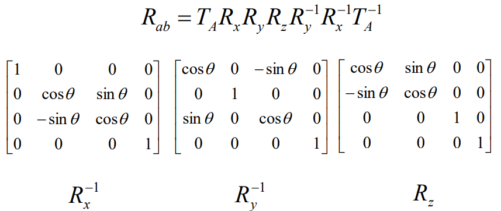

## 投影变换分类
1. 平行投影

   - 用定义投影线方向的投影向量给出一个平行投影。
      - 当投影(向量)垂直于观察平面时，得到正平行投影(正投影)
      - 否则为斜平行投影


   - 当投影平面与某一坐标轴垂直时，得到的投影称为三视图(包括前视图、侧视图和顶(俯)视图)
   - 当投影平面不与某一坐标轴垂直时，形成的投影称为正轴测图，用来显示物体多个侧面
   - 投影平面三个法向量模|nx|、|ny|和|nz|全相等时，正轴测图为等轴测
   - 其中两个相等时为正二测
   - 各不相同时为正三测

2. 斜投影
   
   - 斜投影由两个角度确定
   - 点(x,y,z)投影到观察平面的(xp,yp)位置
   - 平面上正投影坐标是(x,y)
   - 从(x,y,z)到(xp,yp)的斜投影线与投影平面中的点(xp,yp)和(x,y)的连线交成角α
   - 点(xp,yp)和(x,y)的连线与观察平面x轴的夹角为β

如下图：  
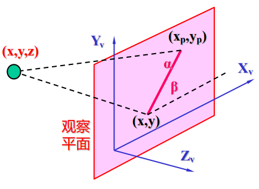

斜投影的计算矩阵如下：  
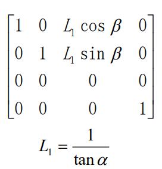

- L1=0 (投射角α为90°)时得正投影
- L1为非零值时产生斜投影
- α通常的值为tanα=1，且所得视图称为斜等测投影
- 所有与投影平面垂直的直线在投影中长度不变
- 投影角α满足tanα=2时，所生成视图称斜二测投影
- 对于这样的角(≈63.4°)，与观察面垂直的线投影成一半长度
- β通常选择为30°或45°，这将显示出一物体的前面、侧面和顶面(或底面)的联合视图

3. 透视投影

   - 对于透视投影，物体的位置沿着收敛于某一点的直线变换到观察平面上，此点称为投影参考点(或投影中心)
   - 物体的投影视图由计算投影线与观察平面的交点而得
   - 透视投影生成真实感视图，但不保持比例关系
   - 对于同样大小的物体，离开投影平面较远的物体其投影图像比较近物体的图像较小
   - 灭点
      - 当物体用透视变换方程投影到观察平面上时，物体中不与观察平面平行的任一族平行线经过透视投影后收敛于一点，此点称为灭点
         - 三维环境中存在无数簇平行线，从而灭点也有无数个。
      - 平行于某一坐标轴的平行线的灭点称为主灭点
         - 用投影平面的方向控制主灭点数目，且据此将透视投影分类为一点、两点或三点透视
         - 投影中主灭点数目是由与观察盘面相交的主轴数目来决定的，主轴数目最多为三个

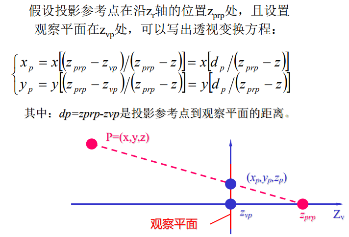
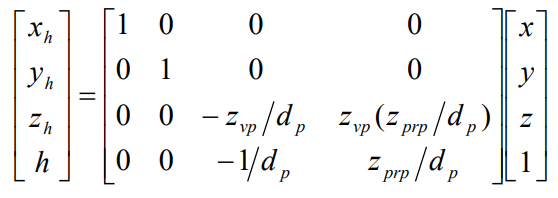


# 参数曲线和曲面基础

## 1、曲线曲面参数表示

$$
平面曲线：P(t)=[x(t),y(t)]\\
空间曲线：P(t)=[x(t),y(t),z(t)]
$$

平面曲线的显式表示：$y=f(x)$  
平面曲线的隐式表示：$f(x,y)=0$

显式或隐式表示的问题：
- 与坐标轴相关
- 可能出现斜率为无穷大的情形(如垂线)
- 不便于计算机编程
  
参数表示的优点：
- 便于处理斜率无穷大的情形，不会因此而中断计算
- 规格化的参数变量$t \in [0,1]$ ，使其相应的几何分量是有界的，而不必考虑边界问题
- 对曲线、曲面进行变换，可以对其参数方程直接进行几何变换
- 便于把低维空间中的曲线、曲面拓展到高维空间
- 易于用矢量和矩阵表示几何分量，简化计算
- 有更大的自由度来控制曲线、曲面的形状

位置矢量：$P(t)=[x(t),y(t),z(t)]$  
切矢量：
   - 将弧长s作为参数，则$T={dP\over ds}=lim_{Δs→0}{ΔP\over ΔS}$  为单位切矢量
   - $T={dP\over dS}={P'(t)\over |P'(t)|}$

法矢量：
   - 与 ${dT\over dS}$ (就是$T'(s)$换了个写法) 平行的法矢量称为曲线在该点的主法矢量
   - 矢量积 $B=T\times N$ 是第三个单位矢量，它垂直于T和N。把平行于矢量B的法矢量称为曲线的副法矢量  
   - 故可推出：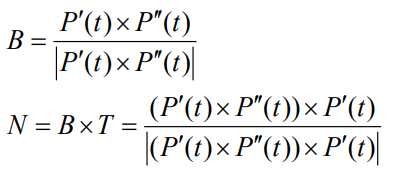
   - 需注意上述关于N的等式其分母应为: $|(P'(t)\times P''(t))\cdot P'(t)|$
   - T、N、B共同构成了曲线上的活动坐标架: 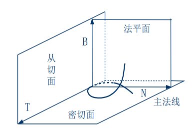

## 2、曲率和挠率
1. 曲率
   1. 其几何意义是曲线的单位切矢量对弧长的转动率$|{dT\over dS}|$
   2. 曲率k的倒数$\rho={1\over k}$
   3. $k=lim_{ΔS→0}|{Δ\theta\over ΔS}|$
   4. 有$T'=kN$
   5. 计算公式如下：
2. 挠率
   1. 挠率的绝对值等于夫法线方向对于弧长的转动率${dB\over dS}$
   2. $|\tau|=lim_{ΔS→0}|{Δ\phi\over ΔS}|$
   3. 计算公式如下：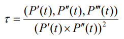
   4. 计算公式的分子应为$(P'(t)\times P''(t))\cdot P'''(t)$
   5. 分子是一个向量，但分母为向量的平方->向量的平方即该向量的模的平方，为一个值

## 3、插值、拟合、逼近、光顺

- 插值
  - 给定一组有序的数据点$P_i,i=0,1,2,3,...,n$，构造一条曲线顺序通过所有数据点，称为对这些数据点进行插值，所构造的曲线称为插值曲线
  - 线性插值
    - 假设给定函数$f(x)$在两个不同的点$x_1$和$x_2$的值，用一个线性函数 $y=ax+b$ 近似代替，称为线性插值函数
  - 抛物线插值
    - 已知在三个互异点$x_1,x_2,x_3$的函数值为$y_1,y_2,y_3$，要求构造一个函数 $\phi(x)=ax^2+bx+c$使得抛物线在节点$x_1,x_2,x_3$处与$f(x)$在节点$x_1,x_2,x_3$处的值相等，称为抛物线插值函数
- 拟合
  - 构造一条曲线使之在某种意义下最接近给定的数据点(但未必通过)，所构造的曲线为拟合曲线
- 逼近
  - 在计算数学中，逼近通常指用一些性质较好的函数近似表示一些性质不好的函数。在计算机图形学中，逼近继承了这方面的含义，因此插值和拟合都可以视为逼近
- 光顺
  - 光顺指曲线的拐点不能太多
  - 对于平面曲线而言，相对光顺的条件是：
    - 具有二阶几何连续性($G^2$)
    - 不存在多余拐点和奇异点
    - 曲率变换比较小

## 4、参数曲线的代数和几何形式
- 代数形式：
  - 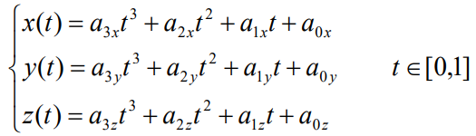
- 矢量形式：
  - $P(t)=a_3t^3+a_2t^2+a_1t+a_0 \\  t\in[0,1]$
- 几何形式：
  - 
  - 令$F_0(t)=2t^3-3t^2+1\\F_1(t)=-2t^3+3t^2\\G_0(t)=t^3-2t^2+t\\G_1(t)=t^3-t^2$
  - 则可得出三次Hermite曲线的几何形式：$P(t)=F_0P_0+F_1P_1+G_0P'_0+G_1P'_1 \ where \ t\in [0,1]$
  - $P_0,P_1,P'_0,p'_1$是几何系数
  - $F_0,F_1,G_0,G_1$是调和函数

## 5、连续性
曲线之间连接的光滑度，有两种度量方式：
1. 参数连续性
   1. 组合参数曲线在连接处具有直到$n$阶连续导矢，即$n$阶连续可微，这类光滑度称之为$C^n$或$n$阶参数连续性
2. 几何连续性
   1. 组合曲线在连接处满足不同于$C^n$的某一组约束条件，称为具有$n$阶几何连续性，记为$G^n$

- 若要求两曲线在结合处达到$C^n$或$G^n$连续，即两曲线在结合处位置连续
- 若要求在结合处达到$G^1$连续，就是说两条曲线在结合处满足$G^0$连续的条件下，并有公共的切矢量$Q'(0)=aP'(1)$
- 当a=1时，$G^1$连续就成为$C^1$连续
- 如图：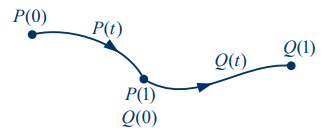
- 若要求在结合处达到$C^2连续，就是说两条曲线在结合处满足$G^2$连续的条件下，并有相同的曲率
- $C^1$连续保证$G^1$连续，$C^2$连续能保证$G^2$连续，但反过来不行
- 即$C^n$连续的条件比$G^n$连续的跳进苛刻

## 6、参数曲面
$P(u,v)=(x(u,v),y(u,v),z(u,v))\\ (u,v)\in [0,1]\times[0,1]$

- 参数曲面上的点：
  - $P(u,v)$
- 参数曲面上的切向量
  - $u$方向：
    - ${\dot{P(u,v)}\over \dot{u}}|_{u=u_0\\v=v_0}$
  - $v$方向：
    - ${\dot{P(u,v)}\over \dot{v}}|_{u=u_0\\v=v_0}$
  - 参数曲面上一点的法向量：
    - ${\dot{P(u,v)}\over \dot{u}}|_{u=u_0\\v=v_0} \times {\dot{P(u,v)}\over \dot{v}}|_{u=u_0\\v=v_0}$


# Bezier曲线与B样条曲线
Bernstein基函数：  
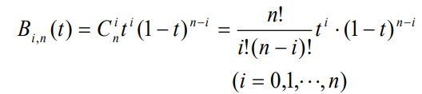  
Bernstein曲线的矩阵表示:
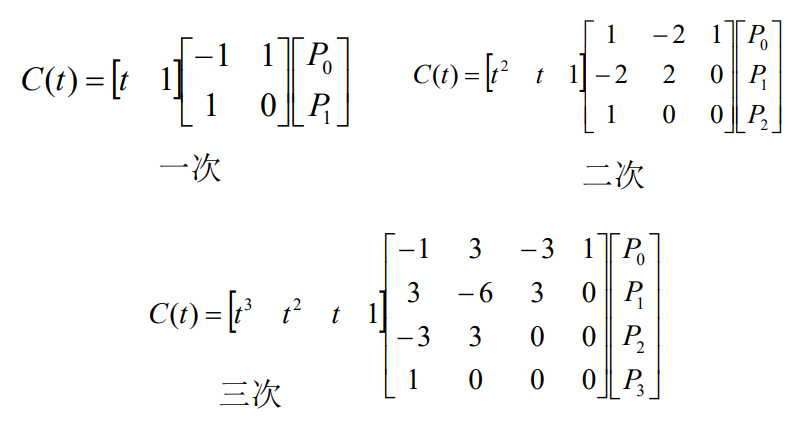
Bezier曲线的递推算法:
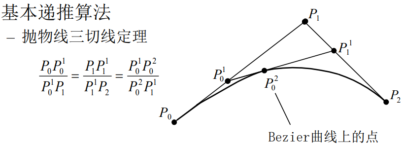


Bezier曲线的拼接：
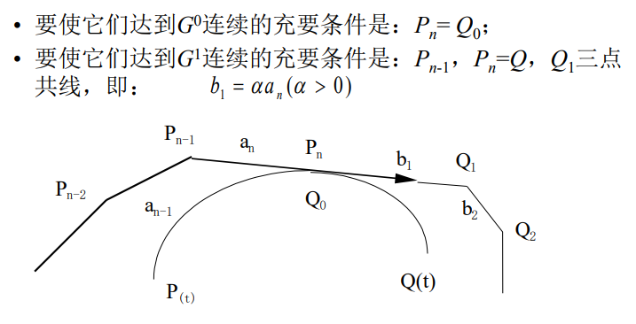

# 真实感图形学

## 1、消隐
消隐：在视点确定后将对象表面不可见的点、线、面消去。执行该功能的算法称为消隐算法。

- 图像空间消隐算法
  - 图像空间算法是以空间内的每个像素为处理单元，确定在每一个像素处，场景中的物体哪一个距离观察点最近，从而用它的颜色来显示像素
  - ```cpp
        for(窗口内每一个像素)
        {
            确定距离视点最近的物体，以该物体表面的颜色来显示像素
        }
    ```
  - 假设场景中有k个物体，平均每个物体表面由h个多边形构成，显示区域中有$m \times n$个像素，则：<a>算法的复杂度为：$O(mnkh)$</a> 
  - **画家算法**：按照画画的顺序，先将距离最远的图形绘制出来，再绘制中层图形，最后绘制最近一层的图形但它无法处理图形互相重叠的情况
  - **Z-buffer算法**：该算法提供帧缓冲器和深度缓冲器，先将Z缓冲器中的值设置为最小值，当要改变某个像素的颜色值时，先检查当前多边形的深度值是否大于该像素原来的深度，如果大于原来的z值，则说明当前多边形更靠近观察点，用它的颜色替换原来像素的颜色。
    - ```cpp
        Z-Buffer算法（）
        {
            帧缓存全置为背景色;
            深度缓存全置为最小z值;
            for(每一个多边形)
            {
                扫描转换该多边形;
                for(该多边形所覆盖的每个象素(x,y) )
                {
                    计算该多边形在该象素的深度值Z(x,y);
                    if(z(x,y)大于z缓存在(x,y)的值)
                    {
                        把z(x,y)存入z缓存中(x,y)处;
                        把多边形在(x,y)处的颜色值存入帧缓存的(x,y)处;
                    }
                }
            }
        }
        ```
- 物体空间消隐算法
  - 假设场景中有k个物体，平均每个物体表面由h个多边形构成，显示区域中有$m \times n$个像素，则算法复杂度为：$O((kh)\times (kh))$
  - ```cpp
    for(场景中的每一个物体)
    {
        将其与场景中的其他物体比较，确定其表面的可见部分;
        显示该物体表面的可见部分;
    }
    ```
- 凸多边形体是由若干个平面围成的物体。假设这些平面方程为  
$a_ix+b_iy+c_iz+d_i=0\\i=1,2,3,...,n$
变换方程的系数，使$(a_i,b_i,c_i)$指向物体外部。那么假设上式定义的凸多面体在以视点为顶点的视图四棱锥内，视点与第$i$个面上一点连线的方向为$(l_i,m_i,n_i)$。那么自隐藏面的判断方法是：$(a_i,b_i,c_i)\cdot (l_i,m_i,n_i)<0$ 。任意两个自隐藏面的交线，为子隐藏线。
- 平面的表示：$H(P)=Ax+By+Cz+D=0$ ,其中 $(A,B,C)$ 即为该平面法线
- 球面的表示：设球心为坐标原点：$H(P)=|P|^2-r^2=0$

- 边界盒检测：使用矩形将多边形包裹起来，通过检测矩形是否与其它物体相交判断边界。这样可以避免在投影之间进行不必要的比较运算，但精度不高，会有边缘盒重叠但图形未重叠的情况出现。

## 2、颜色
颜色是外来的光刺激作用于人的视觉器官而产生的主观感受，影响因素主要有：  
  - 物体本身  
  - 光源
  - 周围环境
  - 观察者的视觉系统

颜色的心理学度量和物理特性：
- 色调(Hue) —— 主波长
- 饱和度(Saturation) —— 纯度
- 亮度(Lightness) —— 明度
  
RGB颜色模型：红绿蓝三元组

RGB转换为HSV：
```cpp
max=max(R,G,B);
min=min(R,G,B);
if (R = max) H = (G-B)/(max-min);
if (G = max) H = 2 + (B-R)/(max-min);
if (B = max) H = 4 + (R-G)/(max-min);
H = H * 60;
if (H < 0) H = H + 360;
V=max(R,G,B);
S=(max-min)/max;
```

HSV转化为RGB:
```cpp
if (s == 0)
    R=G=B=V
else 
{
    H /= 60;
    i = INTEGER(H)
    f = H - i
    a = V * ( 1 - s )
    b = V * ( 1 - s * f )
    c = V * ( 1 - s * (1 - f ) )
    switch (i)
    case 0:
        R = V; G = c; B = a;
    case 1: 
        R = b; G = v; B = a;
    case 2: 
        R = a; G = v; B = c;
    case 3: 
        R = a; G = b; B = v;
    case 4: 
        R = c; G = a; B = v;
    case 5: 
        R = v; G = a; B = b;
}
```

## 3、简单光照模型

- Phong光照模型
  - 物体间作用表示为环境光
    - 假定物体不透明
    - 则在空间中近似均匀分布，即在任何位置、任何方向上的强度一样的光为环境光，称为：$I_a$
    - 环境光反射系数$K_a$：在分布均匀的环境光照射下，不同物体表明啊所呈现的亮度不一定相同，因为它们的环境光反射系数不同
    - 光照方程：$I_e = K_a \times I_a$
    - $I_e$为物体表面所呈现的亮度
    - 环境光模型虽然不同的物体具有不同的亮度，但是同一个物体的表面的亮度是一个恒定值，没有明暗的自然过渡。
    - 点光源：
      - 几何形状为一个点，位于空间中的某个位置，向周围所有方向辐射强度相等的光，记为$I_p$
  - 漫反射
    - 漫反射一般指粗糙、无光泽物体表面对光的反射。
    - 光照方程：$I_d=I_pK_dcos\theta$  其中 $\theta \in [0,{\pi\over 2}]$
    - $I_d$为漫反射的亮度、$I_p$为点光源的亮度、$K_d$为漫反射系数、$\theta$为入射角
    - 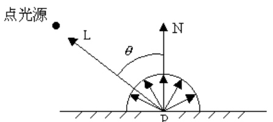
    - 环境光与漫反射相叠加：$I=I_e+I_d$
  - 镜面反射
    - 镜面反射一般指光滑物体表面对光的反射
    - 观察者只能在反射方向上才能看到反射光，偏离了该方向则看不到任何光。
    - 光照方程：$I_s=I_pK_scos^n\alpha$
    - $I_s$为镜面反射的光强、$I_p$为点观光源强度、$K_s$为与物体有关的镜面反射系数、$n$为镜面反射指数，$n$的取值与物体表面的粗糙程度有关，一般为1~2000
      - $n$越大，表面越平滑，散射现象越少
      - $n$越小，表面越毛糙，散射现象越严重
    - 空间分布具有一定方向性
    - 光强不仅取决于入射光和表面材料，还与观察方向有关
    - 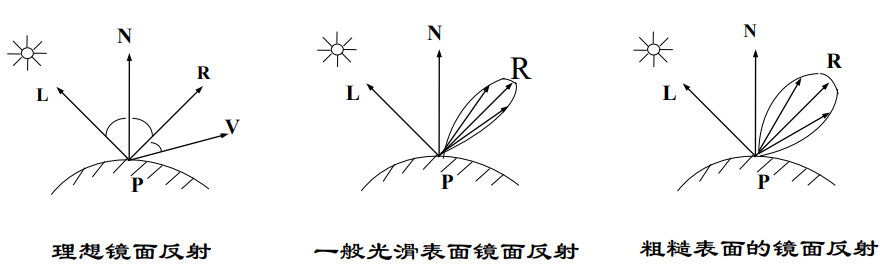
  - 简单光照模型方程即为：$I=I_e+I_d+I_s=I_aK_a+I_p(K_d(L\cdot N)+K_s(V\cdot R)^n)$
  - Phong模型的缺陷：
    - 显示出的物体塑料感强，无质感变化
    - 环境光是常量，没有考虑物体间相互反射光
    - 镜面反射颜色是光源颜色，与材质无关
    - 镜面反射在大入射角时会产生失真
- 纹理
  - 纹理是物体表面的细小结构
  - 纹理类型：颜色纹理、几何纹理
- 阴影
  - 光源照射不到的物体后面形成的三维多面体阴影区域称为阴影域
  - 透视变换生成图像的过程中，屏幕视域空间是一个四棱锥，对物体的阴影域进行裁剪，就会变成封闭多面体，称其为阴影域多面体
  - 场景中的物体，只要与这些阴影域进行三维布尔交运算，计算出的交集就是物体表面的阴影区域

# 整体光照模型

- 局部光照模型
  - 在真实感图形学中，仅处理光源直接照射物体表面的光照模型称为局部光照模型，与此对应的可以处理物体之间的光照作用的模型称为整体光照模型。
  - 简单光照模型可以计算经过点光源照明的物体表面的光强，实际上就是一种局部光照模型。但是这种模型认为镜面反射项与物体表面材质无关，故这只是一种经验模型。
  - 局部光照模型是基于入射光能量导出的光辐射模型，而简单光反射模型基于经验，前者更具有理论基础。
  - 局部光照模型的反射项以实际物体表面的微平面为基础，反应表面的粗糙度对反射光强的影响，比简单光照模型更精确。
  - 局部光照模型根据材料的物理材质决定颜色，而简单光照模型的高光颜色与材料无关。
  - 用简单光照模型生成的物体图像，看上去像塑料，显示不出磨亮的金属光泽；而局部光照模型中，反射光强的计算考虑了物体材质的影响，可以模拟金属的光泽
  - 简单光照模型和局部光照模型，虽然可以生成物体的真实感图像，但只是处理光源直接照射物体表面的光强计算，不能很好地模拟光的折射、反射和阴影等，也不能用来表示物体间的相互光照影响
  - 基于简单光照模型的光透射模型，虽然可以模拟光的折射，但是这种折射的计算范围很小，不能很好地模拟多个透明体之间复杂的光照现象
- 整体光照模型
  - 整体光照模型是一种更精确的光照模型，它是相较于局部光照模型而言的
  - 在现有的整体光照模型中，主要有光线跟踪和辐射度两种方法，它们是当今真实感图形学中最重要的两种图形绘制技术。
- 光线追踪
  - 由光源发出的光到达物体表面后，产生反射和折射，简单光照模型和光透视模型模拟了这两种现象。在简单光照模型中，反射光被分为漫反射光和镜面反射光。简单光透射模型把透射光分为漫透射光和规则透射光
  - 由光源发出的光称为直接光，物体对直接光的反射或折射分别称为直接反射和直接折射
  - 把物体表面间反射和折射的光称为间接光，并称这种反射为间接反射
  - 光线在物体之间的传播方式，是光线追踪算法的基础
  - 最基本的光纤追踪算法是跟踪镜面反射和折射。从光源发出的光遇到物体的表面，发生反射和折射，光就改变方向，沿着反射方向和折射方向继续前进，直到遇到新的物体
  - 光源发出光纤，经过反射与折射，只有很少一部分可以进入人的眼睛，因此实际光线追踪算法的跟踪方向是与光的传播方向相反的，是一种视线跟踪
  - 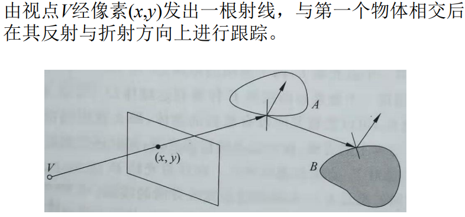
  - 4种光线的定义：由视点经像素(x,y)发出的射线，即视线；物体表面上点与光源的连线，即阴影测试线、反射光线、折射光线
  - 光强的计算方法：当光线与物体表面相交于点P时，光在点P对光线方向的贡献分为三部分，三部分光强相加，就是该条光线在点P处的总光强。
    1. 由光源产生的直接光照射光强，是交点处的局部光强
    2. 反射方向上由其他物体引起的间接光照光强
    3. 折射方向上由其他物体引起的间接光照光强
  - 光线跟踪算法实际上是自然界光照明物理过程的近似逆过程，这一过程可以跟踪物体间的镜面反射光线和规则透射，模拟了理想表面的光的传播
  - 光线跟踪的终止条件：
    - 该光线未碰到任何物体
    - 该光线碰到了背景
    - 该光线在经过多次反射和折射后产生衰减，其对于视点的光强贡献值很小(小于预设值)
    - 光线反射或折射次数即跟踪次数大于给定值(预设值)
  - 光线跟踪伪代码：
    - ```cpp
        RayTracing(start,direction,weight,color) 
        {
            if(weight<MinWeight)
            {
                color=black
            }
            else {
                if(与场景中所有物体没有交点)
                {
                    color=black
                }
                else {
                    I_local = 在交点处用局部光照模型计算出的光强;
                    计算反射方向R;
                    RayTraycing(最近的交点,R,weight*w_r,I_r);
                    计算折射方向T;
                    RayTraycing(最近的交点,T,weight*w_t,I_t);
                }
            }
        }
      ```